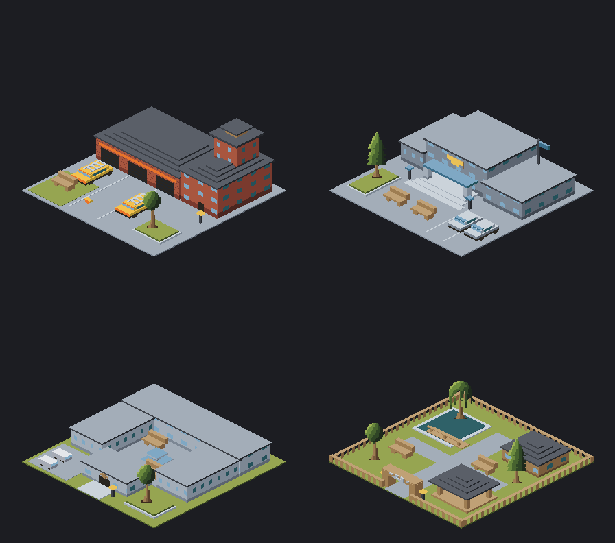

# Larger civic artwork

Four original 3×3 campuses are ready in `js/art/civics-large.js`:

| Kind | Design |
|---|---|
| `fire` | Brick firehouse, three engine bays, ladder engines, crew wing and hose tower |
| `police` | Stepped public entrance, blue portico, gold badge, flag and patrol parking |
| `centre` | Pale treatment wings around a fountain courtyard, projecting reception and van bay |
| `zoo` | Paw gate, fenced gardens, pond overlook, keeper kiosk and roost pavilion |

## Placement integration

Use `art.civic(kind, 3)` once the simulation allocates a 3×3 footprint. Each
sprite declares `[3, 3]`, uses a 24-unit hub, and has its solid recipe registered
for `art.hires(sprite)`. All solids fit within 48×48 world units. Use the existing
multi-tile painter placement and depth ordering; no special sprite offsets
are needed. The park remains its existing size.

This change supplies artwork only. `art.civic(kind)` retains the existing
1×1 station/centre and 2×2 zoo art so old callers cannot draw a large campus
over neighbouring occupied tiles. The placement agent should pass side 3 in
both the world renderer and build preview when the new footprint is allocated;
old saves need the simulation's migration policy before switching their art.

`node tools/shots.mjs --sheet` regenerates normal and high-resolution civic
sheets. `node tools/check.mjs` includes these sprites in palette, footprint,
hi-res and pedestrian depth audits, plus explicit API compatibility checks.
